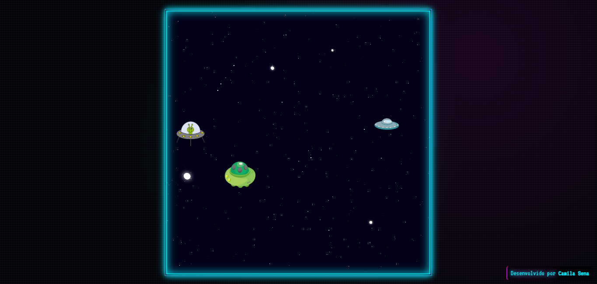

# 🚀 Space Shooter Cyberpunk 🚀

Um jogo de nave espacial com temática cyberpunk, desenvolvido com JavaScript puro, HTML5 e CSS3.



## 📋 Descrição

Space Shooter Cyberpunk é um jogo de tiro espacial onde você controla uma nave e deve impedir que aliens invadam seu planeta. O jogo apresenta um visual cyberpunk com cores neon vibrantes, efeitos de brilho e uma estética retro-futurista.

## 🎮 Como Jogar

1. Abra o arquivo `index.html` em seu navegador
2. Clique em "START" para iniciar o jogo
3. Use as teclas de seta ⬆️⬇️ ou W/S para mover sua nave para cima e para baixo
4. Pressione a barra de espaço para atirar
5. Evite que os aliens alcancem o lado esquerdo da tela
6. Destrua o máximo de aliens que conseguir!

## 🔧 Tecnologias Utilizadas

- HTML5
- CSS3
- JavaScript Puro (Vanilla JS)
- Fontes do Google (VT323)

## ✨ Recursos e Características

- Design com tema cyberpunk galático
- Efeitos visuais de neon e brilho
- Controles intuitivos (teclado)
- Sistema de colisão
- Animações suaves
- Mecânica simples de jogo
- Modal de início e de game over
- Design responsivo
- Compatível com navegadores modernos

## 📁 Estrutura do Projeto

```
space-shooter/
│
├── index.html          # Arquivo HTML principal
├── style.css           # Estilos CSS
├── script.js           # Lógica do jogo em JavaScript
├── README.md           # Este arquivo
│
└── img/                # Diretório de imagens
    ├── hero.png        # Nave do jogador
    ├── monster-1.png   # Alien tipo 1
    ├── monster-2.png   # Alien tipo 2
    ├── monster-3.png   # Alien tipo 3
    ├── shoot.png       # Tiro da nave
    ├── explosion.png   # Explosão do alien
    ├── space.png       # Fundo do jogo
    └── favcon.ico      # Ícone da página
```

## 🚀 Melhorias Futuras

- Sistema de pontuação
- Diferentes níveis de dificuldade
- Power-ups e habilidades especiais
- Efeitos sonoros e música de fundo
- Suporte para dispositivos móveis (touch)
- Mais tipos de inimigos
- Chefes (boss fights)

## 🔍 Desafios de Desenvolvimento

Durante o desenvolvimento, enfrentamos e superamos vários desafios:

- Implementação do sistema de colisão
- Criação de efeitos visuais cyberpunk com CSS puro
- Otimização do desempenho do jogo
- Desenvolvimento de uma interface visual atraente

## 📝 Licença

Este projeto está sob a licença MIT. Veja o arquivo [LICENSE](LICENSE) para mais detalhes.

## 👩‍💻 Autora

Desenvolvido por [Camila Sena](https://github.com/camilasena-a)
